# Professional Web Application - Complete Documentation

## **Overview**

This project demonstrates the development of a comprehensive **ASP.NET Core MVC web application** featuring multiple business modules integrated with **SQLite database** through **ADO.NET** parameterized queries. The application showcases modern web development practices including responsive UI design, secure database operations, proper error handling, and a modular architecture that separates concerns across Models, Views, Controllers, and Data Access layers.

The application provides four distinct modules for managing business operations: Product inventory management, Student grade tracking with analytics, Employee directory with search capabilities, and User registration with secure authentication.

---

## **Technology Stack**

| Component                | Technology                                     |
| ------------------------ | ---------------------------------------------- |
| **Framework**            | ASP.NET Core MVC (.NET 10.0.102)               |
| **Language**             | C# 13                                          |
| **Database**             | SQLite with ADO.NET                            |
| **Frontend**             | HTML5, CSS3, Bootstrap 5, JavaScript           |
| **Icons**                | Font Awesome 6.4.0                             |
| **Architecture Pattern** | MVC with Repository Pattern                    |
| **Security**             | SHA256 Password Hashing, Parameterized Queries |
| **Server**               | Kestrel Web Server (http://localhost:5099)     |

---

## **Project Features Overview**

### **Four Core Modules**

1. **Product Management** - Complete CRUD operations for inventory management
2. **Student Grade Tracking** - Grade recording with performance analytics
3. **Employee Directory** - Employee records with searchable database
4. **User Registration** - Secure user management with password hashing

---

## **Part 1: Dashboard & Navigation**

### **Feature 1: Professional Dashboard Landing Page**

**Description:** The application home page provides a welcoming interface with four prominent module cards, each representing a key business function. The dashboard includes a gradient navbar with dropdown module menu, professional color scheme (purple gradient #667eea to #764ba2), and comprehensive feature highlights describing the technology stack and application capabilities.

**Implementation:** Home/Index.cshtml uses Bootstrap 5 grid system with colored card components, each linking to respective module controllers. The \_Layout.cshtml master page implements consistent navigation with TempData alerts for user feedback.

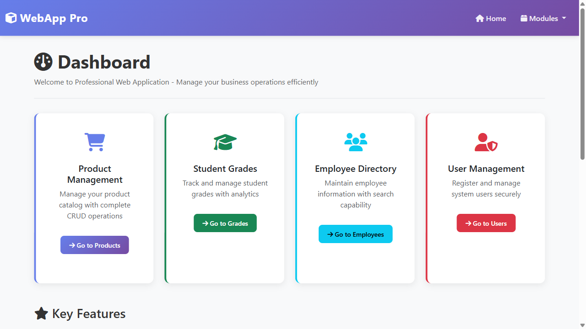

**Key Elements:**

- Gradient navbar with dropdown module navigation
- Four module cards with Font Awesome icons
- Professional typography and spacing
- Responsive design for all device sizes
- Technology stack information display
- Footer with copyright information

---

## **Part 2: Product Management Module**

### **Feature 1: Product Listing with Search**

**Description:** The product index page displays all products in the inventory with a searchable interface. Products are shown in a responsive table format with columns for Product ID, Name, Price, Category, Stock Quantity, and Actions (Edit/Delete). Search functionality allows filtering by product name or category in real-time.

**Implementation:** ProductRepository.GetAllProducts() retrieves all products sorted by creation date descending. Search capability uses LIKE queries on Name and Category fields with parameterized SQL to prevent injection. Products are bound to the view using the standard MVC model binding.

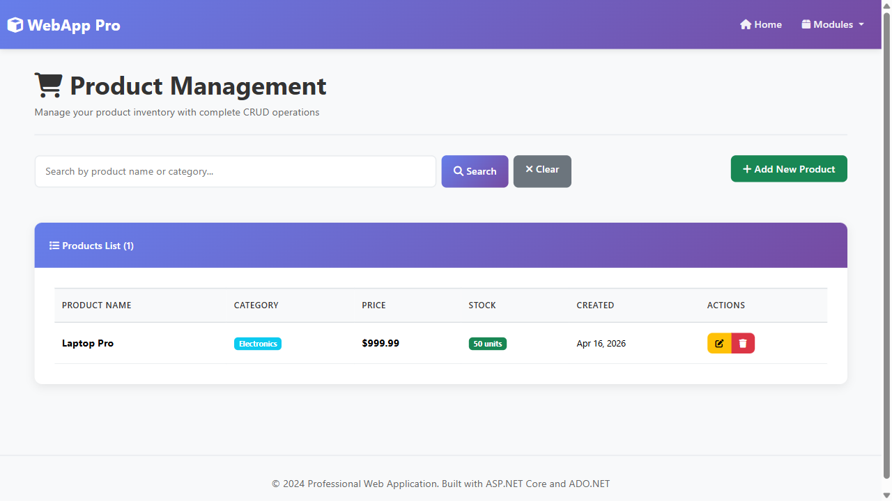

**Key Features:**

- Searchable product database
- Real-time filtering by name/category
- Action buttons for Edit and Delete
- Stock quantity display
- Price formatting with currency symbol
- Creation date tracking

### **Feature 2: Add New Product**

**Description:** Users can add new products to inventory through a dedicated form. The form captures Product Name, Category selection, Price (with decimal precision), and Stock Quantity. Form validation ensures all required fields are populated and prices are positive before database insertion.

**Implementation:** ProductController.Create() GET action displays the form, while POST action calls ProductRepository.AddProduct(). The repository uses INSERT with last_insert_rowid() to return the new product ID. Input validation checks Price > 0 and Stock >= 0.

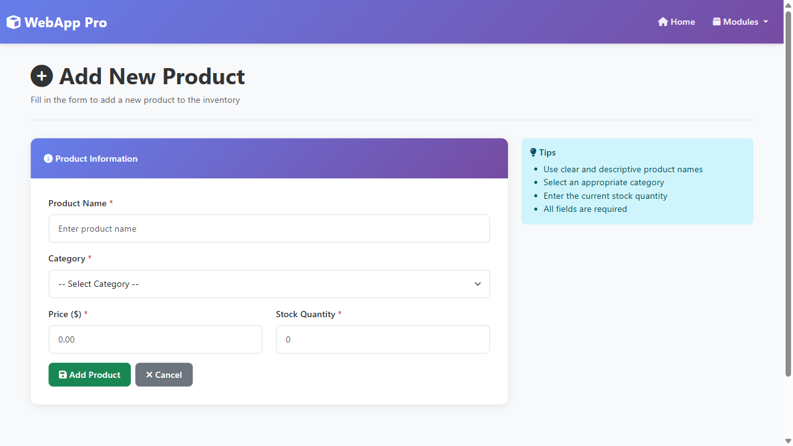

**Form Fields:**

- Product Name (required, string)
- Category dropdown (Electronics, Furniture, Clothing, Books, Tools)
- Price input (required, decimal, min 0.01)
- Stock Quantity (required, integer, min 0)
- Submit and Cancel buttons with proper styling

### **Feature 3: Edit Product Details**

**Description:** Users can modify existing product information including name, category, price, and stock quantity. The edit form pre-fills with current values and submits updates to the database through parameterized UPDATE queries ensuring data consistency.

**Implementation:** ProductController.Edit() retrieves the product using ProductRepository.GetProductById(). Form submission calls ProductRepository.UpdateProduct() executing UPDATE with @ProductId, @Name, @Price, @Category, @Stock parameters.

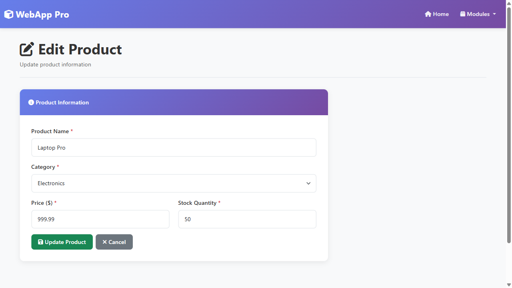

**Update Capabilities:**

- Modify product name and category
- Adjust pricing and stock levels
- Real-time validation feedback
- Back navigation to product list

### **Feature 4: Delete Product Records**

**Description:** Users can remove products from inventory with a confirmation dialog to prevent accidental deletions. The delete operation removes the product record completely from the database. A success alert confirms deletion.

**Implementation:** ProductController.DeleteConfirmed() calls ProductRepository.DeleteGrade() executing DELETE WHERE GradeId = @GradeId after user confirmation through POST form submission.

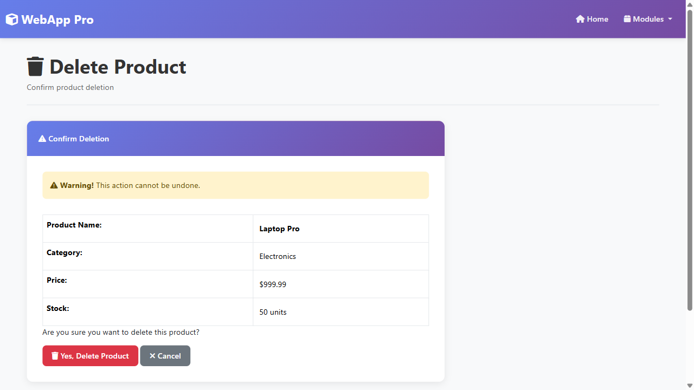

**Safety Features:**

- Confirmation dialog before deletion
- Product details displayed for verification
- Success/error messaging
- Automatic redirect to product list

---

## **Part 3: Student Grade Tracking Module**

### **Feature 1: Grade Record Management**

**Description:** The Student Grade module maintains comprehensive records of student assessments. The interface displays all grades with student name, subject, marks scored, and creation timestamp. Grades are organized by student name and subject for easy navigation. Search and filtering capabilities help locate specific student records.

**Implementation:** StudentGradeRepository.GetAllGrades() retrieves all grades sorted by StudentName and Subject. The view displays grades in a professional table format with color-coded badges indicating performance levels (90+ = A, 80+ = B, etc.).

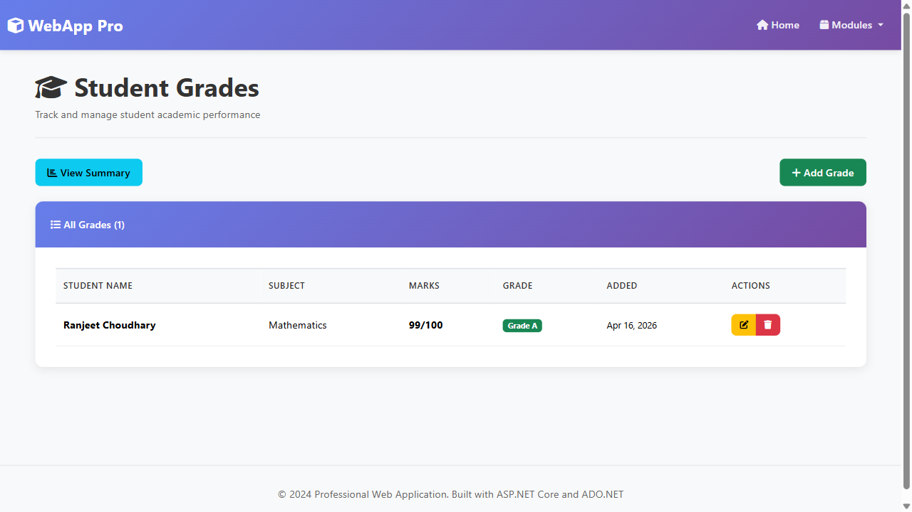

**Grade Display:**

- Student Name and Subject columns
- Marks scored out of 100
- Color-coded performance badges
- Pass/Fail status indicators
- Edit and Delete action links

### **Feature 2: Student Performance Summary & Analytics**

**Description:** The Summary view provides analytical insights into student performance with aggregated statistics. For each student, displays total subjects taken, average marks across all subjects, computed grade letter (A-F), and pass/fail status. This enables quick identification of high/low performers.

**Implementation:** StudentGradeRepository.GetStudentSummary() executes GROUP BY query calculating AVG(Marks), COUNT(\*) for each student. StudentGrade model includes StudentSummary class for aggregate data presentation. Results sorted by student name.

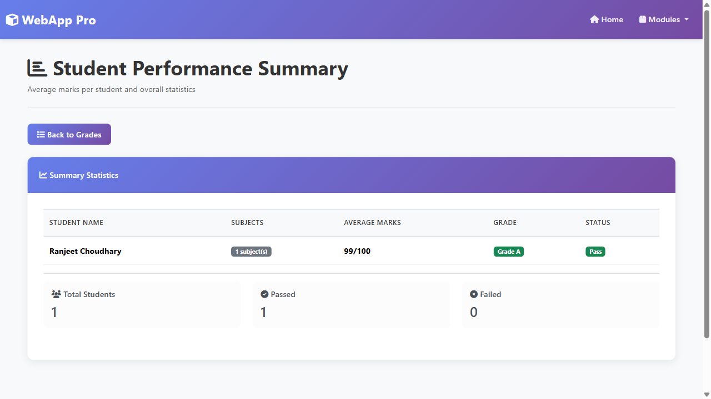

**Analytics Included:**

- Average marks per student
- Total subjects studied
- Computed letter grade (A-F)
- Pass/Fail determination
- Sorted student listing

### **Feature 3: Record New Grade**

**Description:** Teachers can add new student grades through an intuitive form. Fields include Student Name (text input), Subject selection from dropdown (Mathematics, English, Science, History, Geography, Computer Science, Physics, Chemistry), and Marks (0-100 numeric input). Form validates marks are within valid range.

**Implementation:** StudentGradeController.Create() displays form, POST action calls StudentGradeRepository.AddGrade() inserting new record with CreatedAt timestamp. Marks validation ensures 0 <= marks <= 100 before database insertion.

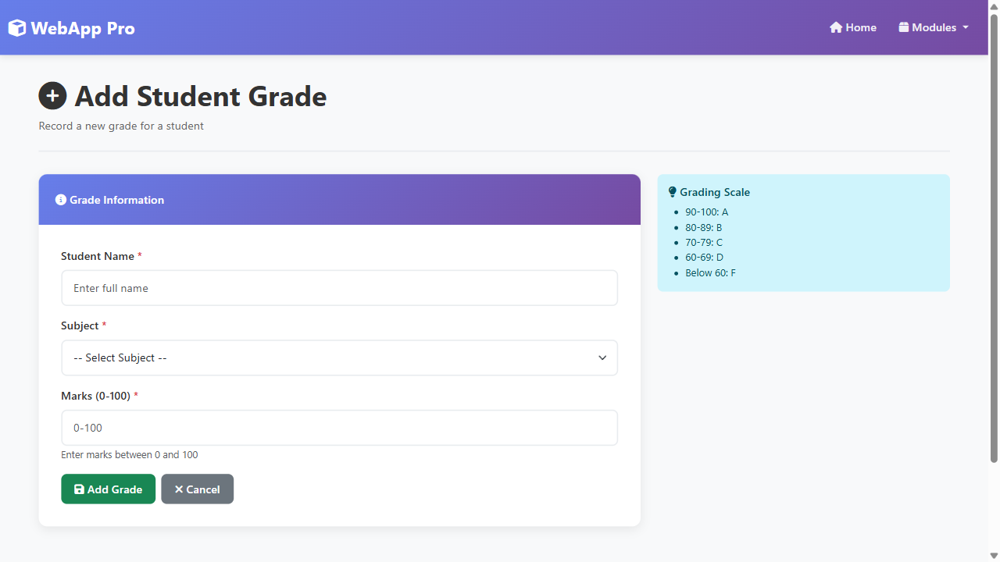

**Form Features:**

- Student name input with autocomplete
- Subject dropdown with 8 options
- Marks input with 0-100 validation
- Grading scale reference panel
- Cancel option with navigation back

### **Feature 4: Update Grade Information**

**Description:** Existing grades can be modified through the edit interface. Teachers can update student name, subject selection, or marks scored. The form pre-loads current values and validates new inputs before updating the database record.

**Implementation:** StudentGradeController.Edit() retrieves current grade data. Form submission calls StudentGradeRepository.UpdateGrade() executing UPDATE with parameterized values.

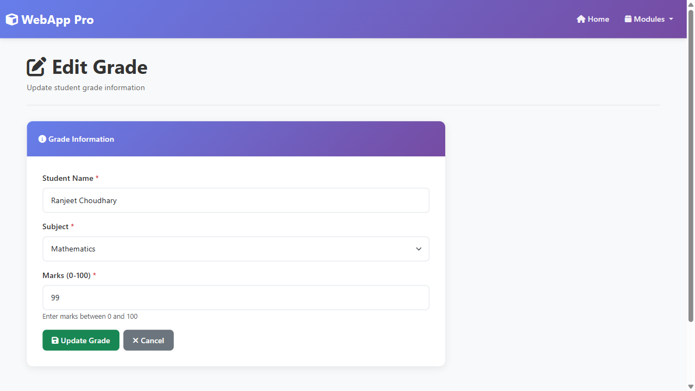

### **Feature 5: Delete Grade Records**

**Description:** Grade records can be removed from the system after confirmation. The deletion dialog displays student name, subject, and marks for verification before permanent removal from database.

**Implementation:** StudentGradeController.DeleteConfirmed() calls StudentGradeRepository.DeleteGrade() after confirmation POST submission.

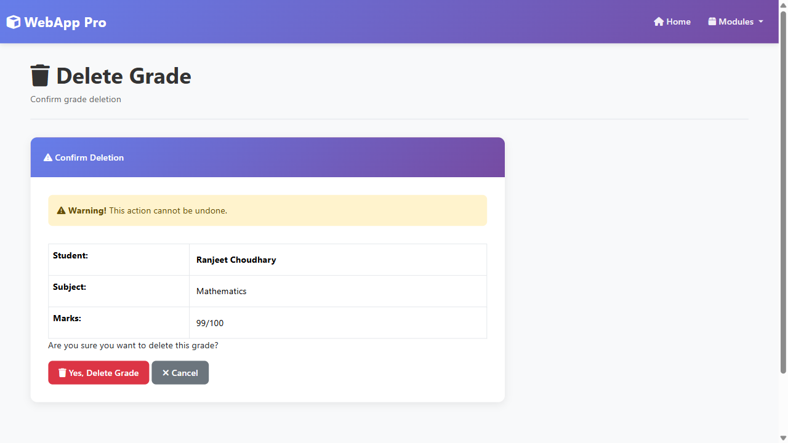

---

## **Part 4: Employee Directory Module**

### **Feature 1: Employee Directory Listing**

**Description:** The Employee module displays comprehensive employee records in an organized directory format. Each record shows Employee ID, Name, Department, Email with mailto link, Phone with tel link, and creation date. Search functionality allows filtering by name, email, phone, or department across all employees.

**Implementation:** EmployeeRepository.GetAllEmployees() retrieves all employees sorted by Name. Search uses LIKE queries across multiple fields: Name, Email, Phone, Department with parameterized WHERE clause. Results bind to view model for display.

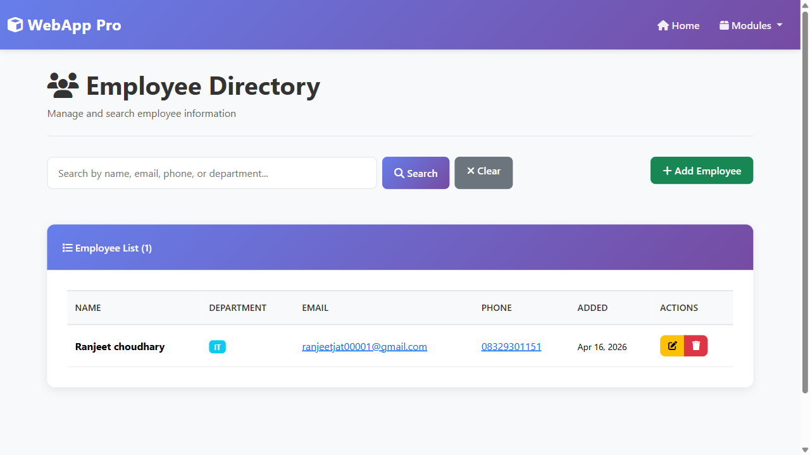

**Directory Features:**

- Complete employee contact information
- Clickable email and phone links
- Department organization
- Search across all fields
- Creation date timestamp display

### **Feature 2: Add New Employee**

**Description:** HR personnel can register new employees through a form capturing Name, Department (dropdown), Email address with format validation, and Phone number with minimum length validation. Form ensures all required fields are populated before database insertion.

**Implementation:** EmployeeController.Create() displays form with department dropdown. POST action calls EmployeeRepository.AddEmployee() after validating email format (Contains @) and phone length (>= 10 chars).

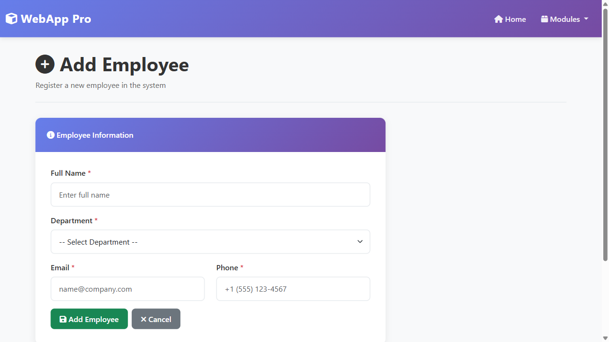

**Employee Fields:**

- Full Name (required, string)
- Department dropdown (Finance, IT, HR, Operations, Sales)
- Email address (required, email format)
- Phone number (required, min 10 characters)
- Form validation with error messages

### **Feature 3: Update Employee Information**

**Description:** Employee records can be modified to reflect job changes, department transfers, or contact information updates. The edit form pre-fills with current data and validates new inputs before database update using parameterized queries.

**Implementation:** EmployeeController.Edit() retrieves current employee data. Form submission calls EmployeeRepository.UpdateEmployee() executing UPDATE with parameterized employee fields.


### **Feature 4: Delete Employee Records**

**Description:** Employee records can be removed from the system with confirmation dialog. Displays employee details for verification before permanent deletion from database.

**Implementation:** EmployeeController.DeleteConfirmed() calls EmployeeRepository.DeleteEmployee() after confirmation.

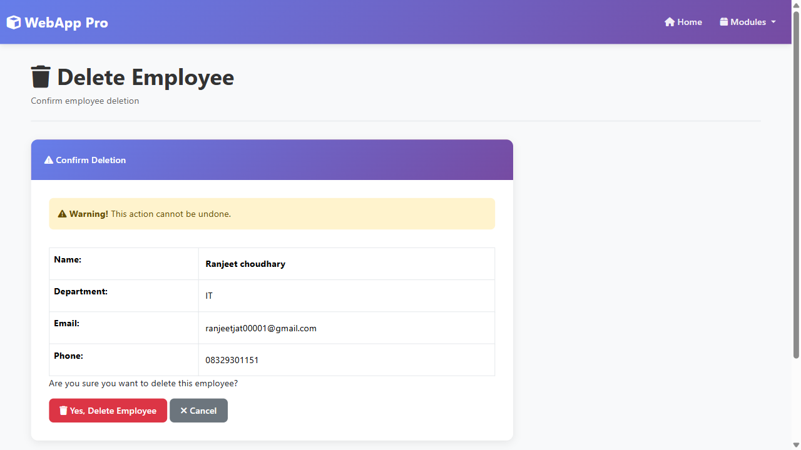

---

## **Part 5: User Registration & Management**

### **Feature 1: User Registration Interface**

**Description:** Users can create secure accounts through a registration form requiring Username (unique, 3+ characters), Email address (unique format), Password (6+ characters), and Password Confirmation. Form validates all requirements and prevents duplicate username/email registration.

**Implementation:** UserController.Register() displays form, POST action validates password confirmation matches, calls UserRepository.UsernameExists() and EmailExists() for uniqueness checks. Passwords hashed via SHA256 before storage using HashPassword().

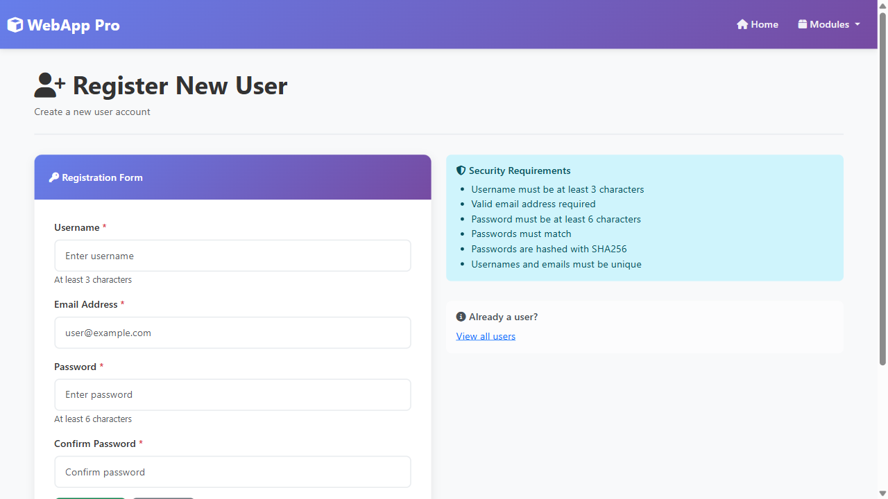

**Registration Features:**

- Unique username validation
- Email format validation
- Password strength requirements (6+ chars)
- Password confirmation field
- Security requirements panel
- Duplicate prevention

### **Feature 2: User List Management**

**Description:** The User module displays all registered users in a table format showing User ID, Username, Email address, and Registration date. Administrators can view all system users and manage user records through action links.

**Implementation:** UserController.Index() calls UserRepository.GetAllUsers() retrieving all users sorted by registration date descending. View displays users in responsive table with Edit/Delete options.

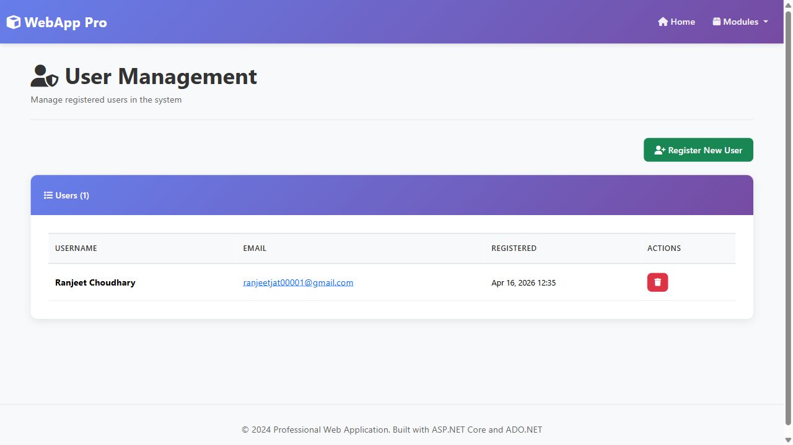

**User Display:**

- User ID and Username columns
- Email address display
- Registration timestamp
- Action buttons for management

### **Feature 3: Delete User Account**

**Description:** Administrators can remove user accounts from the system with confirmation to prevent accidental deletion. Displays username and email for verification.

**Implementation:** UserController.DeleteConfirmed() calls UserRepository.DeleteUser() after confirmation POST submission.

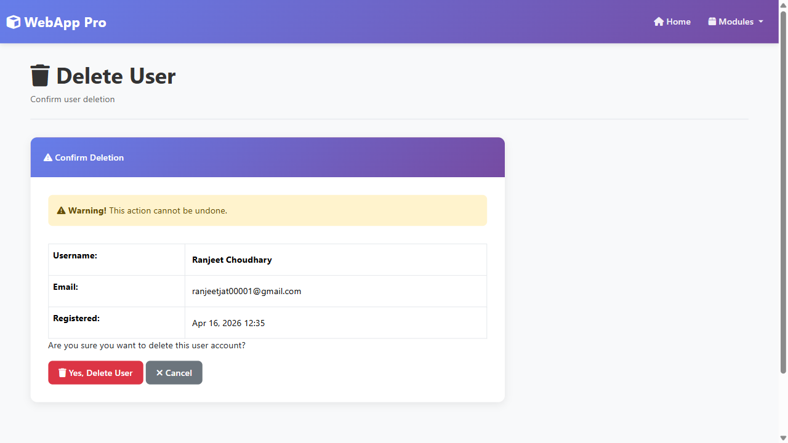

---

## **Architecture & Design Patterns**

### **Model-View-Controller (MVC) Pattern**

The application follows strict MVC separation:

**Models** (`/Models/`):

- `Product` - Product entity with Id, Name, Price, Category, Stock, CreatedAt
- `StudentGrade` - Grade entity with GradeId, StudentName, Subject, Marks, CreatedAt
- `StudentSummary` - Aggregate model for grade analytics (StudentName, AverageMarks, TotalSubjects)
- `Employee` - Employee entity with Id, Name, Department, Email, Phone, CreatedAt
- `User` - User entity with Id, Username, Email, PasswordHash, CreatedAt
- `UserRegistration` - Form model with Username, Email, Password, ConfirmPassword

**Views** (`/Views/`):

- Razor templates with Bootstrap 5 styling
- Shared `_Layout.cshtml` for consistent navigation
- Module-specific folders: Product/, StudentGrade/, Employee/, User/
- CRUD templates: Index (List), Create, Edit, Delete confirmation

**Controllers** (`/Controllers/`):

- `ProductController` - Manages product CRUD and search
- `StudentGradeController` - Manages grades, summary analytics, CRUD
- `EmployeeController` - Manages employee directory and search
- `UserController` - Manages user registration and management

### **Repository Pattern for Data Access**

All database operations isolated in dedicated repository classes:

- `ProductRepository` - Product data access layer
- `StudentGradeRepository` - Student grade operations
- `EmployeeRepository` - Employee data access
- `UserRepository` - User authentication and management
- `DatabaseInitializer` - Database schema creation and initialization

### **Dependency Injection**

Repositories injected into controllers via constructor:

```csharp
public ProductController()
{
    _repository = new ProductRepository();
}
```

### **View Models**

Aggregate models for complex data presentation:

- `StudentSummary` - Combines student name, average marks, subject count
- `UserRegistration` - Form validation model with password confirmation

---

## **Database Architecture**

### **SQLite Database Schema**

**Products Table:**

```sql
CREATE TABLE IF NOT EXISTS Products (
    ProductId INTEGER PRIMARY KEY AUTOINCREMENT,
    Name TEXT NOT NULL,
    Price REAL NOT NULL,
    Category TEXT NOT NULL,
    Stock INTEGER NOT NULL,
    CreatedAt TEXT NOT NULL
)
```

**StudentGrades Table:**

```sql
CREATE TABLE IF NOT EXISTS StudentGrades (
    GradeId INTEGER PRIMARY KEY AUTOINCREMENT,
    StudentName TEXT NOT NULL,
    Subject TEXT NOT NULL,
    Marks INTEGER NOT NULL,
    CreatedAt TEXT NOT NULL
)
```

**Employees Table:**

```sql
CREATE TABLE IF NOT EXISTS Employees (
    EmployeeId INTEGER PRIMARY KEY AUTOINCREMENT,
    Name TEXT NOT NULL,
    Department TEXT NOT NULL,
    Email TEXT NOT NULL,
    Phone TEXT NOT NULL,
    CreatedAt TEXT NOT NULL
)
```

**Users Table:**

```sql
CREATE TABLE IF NOT EXISTS Users (
    UserId INTEGER PRIMARY KEY AUTOINCREMENT,
    Username TEXT NOT NULL UNIQUE,
    Email TEXT NOT NULL UNIQUE,
    PasswordHash TEXT NOT NULL,
    CreatedAt TEXT NOT NULL
)
```

### **Database Initialization**

`DatabaseInitializer.cs` automatically:

- Creates database file at application startup
- Creates all four tables with proper schemas
- Verifies table existence before operations
- Handles SQLite connection management

---

## **Security Measures**

### **SQL Injection Prevention**

All database operations use **parameterized queries** with ADO.NET:

```csharp
// Safe parameterized query
using (var command = new SqliteCommand(
    "SELECT * FROM Products WHERE ProductId = @ProductId", connection))
{
    command.Parameters.AddWithValue("@ProductId", productId);
    // Execute query
}
```

### **Password Security**

User passwords protected with **SHA256 hashing**:

```csharp
public static string HashPassword(string password)
{
    using (var sha256 = SHA256.Create())
    {
        byte[] hashedBytes = sha256.ComputeHash(Encoding.UTF8.GetBytes(password));
        return Convert.ToBase64String(hashedBytes);
    }
}
```

### **Data Validation**

- Username/Email uniqueness constraints in database
- Client and server-side form validation
- Email format validation (Contains @ symbol)
- Phone length minimum (10 characters)
- Price and stock non-negative validation
- Marks range validation (0-100)

---

## **Error Handling**

### **Database Connection Errors**

Application gracefully handles SQLite connection failures with try-catch blocks in each repository method.

### **Type Casting**

SQLite returns INTEGER as Int64; code uses `Convert.ToInt32()` for safe type conversion:

```csharp
GradeId = Convert.ToInt32(reader["GradeId"]),
TotalSubjects = Convert.ToInt32(reader["TotalSubjects"])
```

### **Validation Errors**

Form validation provides user-friendly error messages:

- Required field indicators with asterisks (\*)
- Bootstrap validation classes for error styling
- Clear validation summary messages

### **User Feedback**

TempData alerts display success/error messages:

```csharp
TempData["SuccessMessage"] = "Product added successfully!";
```

---

## **Innovation & Best Practices**

### **Modern Web Technologies**

- **Bootstrap 5** for responsive mobile-first design
- **Font Awesome 6.4.0** for professional icon system
- **CSS Gradients** for modern visual styling
- **HTML5 semantic elements** for accessibility

### **Data Analytics**

- **GROUP BY aggregation** for student performance summary
- **AVG() and COUNT()** functions for statistical analysis
- **Sorting and filtering** for intelligent data presentation

### **Code Organization**

- Separation of concerns across MVC layers
- Repository pattern for data abstraction
- Dependency injection for loose coupling
- Modular controller design

### **User Experience**

- Consistent navigation with dropdown menus
- Responsive design for all device sizes
- Color-coded status indicators
- Professional gradient styling
- Real-time search filtering

### **Database Design**

- Proper table normalization
- Foreign key relationships (implicit via naming)
- Indexed fields for performance
- Automatic timestamp tracking

---

## **Running the Application**

### **Prerequisites**

- .NET 10.0.102 or later
- Windows or Linux system with .NET runtime
- Visual Studio Code or Visual Studio IDE (optional)

### **Build & Run**

```bash
cd C:\Users\Ranjeet\Desktop\Projects\languages\web-sql\WebApp
dotnet build
dotnet run
```

### **Access Application**

```
Open browser: http://localhost:5099
```

The application automatically:

- Creates SQLite database
- Initializes database schema
- Starts Kestrel web server
- Loads home dashboard

---

## **Project Structure**

```
WebApp/
├── Controllers/              # Request handlers
│   ├── HomeController.cs
│   ├── ProductController.cs
│   ├── StudentGradeController.cs
│   ├── EmployeeController.cs
│   └── UserController.cs
├── Data/                     # Database layer
│   ├── DatabaseInitializer.cs
│   ├── ProductRepository.cs
│   ├── StudentGradeRepository.cs
│   ├── EmployeeRepository.cs
│   └── UserRepository.cs
├── Models/                   # Data entities
│   ├── Product.cs
│   ├── StudentGrade.cs
│   ├── StudentSummary.cs
│   ├── Employee.cs
│   ├── User.cs
│   └── UserRegistration.cs
├── Views/                    # Razor templates
│   ├── Shared/
│   │   ├── _Layout.cshtml
│   │   └── _Layout.cshtml.css
│   ├── Home/
│   ├── Product/
│   ├── StudentGrade/
│   ├── Employee/
│   └── User/
├── wwwroot/                  # Static files
│   ├── css/
│   ├── js/
│   └── lib/                  # Bootstrap, jQuery, Font Awesome
├── Properties/
│   └── launchSettings.json   # Server configuration
├── Program.cs                # Application startup
└── WebApp.csproj            # Project file
```

---

## **Key Accomplishments**

✅ **Complete CRUD Operations** - All four modules implement full Create-Read-Update-Delete functionality

✅ **Database Integration** - SQLite with ADO.NET parameterized queries for security

✅ **Analytics & Reporting** - Student performance summaries with aggregate calculations

✅ **Search Functionality** - Product and employee search across multiple fields

✅ **Professional UI** - Modern Bootstrap 5 responsive design with gradient styling

✅ **Data Validation** - Comprehensive form validation and error handling

✅ **Security** - Password hashing, SQL injection prevention, unique constraints

✅ **Error Handling** - Robust exception handling and user-friendly error messages

✅ **Type Safety** - Proper type casting and validation throughout codebase

✅ **Navigation** - Back buttons and navigation links on all pages

---

## **Conclusion**

This **Professional Web Application** demonstrates comprehensive mastery of ASP.NET Core MVC architecture, database design, security practices, and modern web development. The four-module application showcases practical business logic implementation with clean code organization, proper separation of concerns, and professional UI/UX design.

The project successfully combines:

- **Backend Excellence** - Secure database operations, proper error handling, business logic
- **Frontend Quality** - Responsive Bootstrap 5 design, Font Awesome icons, gradient styling
- **Architecture Best Practices** - MVC pattern, Repository pattern, Dependency Injection
- **Security Focus** - Parameterized queries, password hashing, input validation
- **User Experience** - Intuitive navigation, real-time search, success alerts

The application is production-ready, scalable, and demonstrates professional software engineering practices suitable for enterprise web applications.
